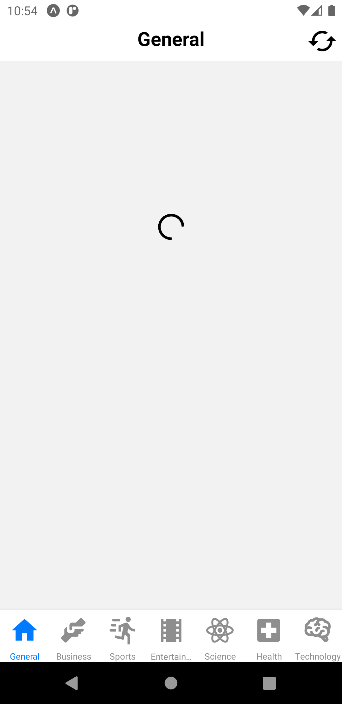
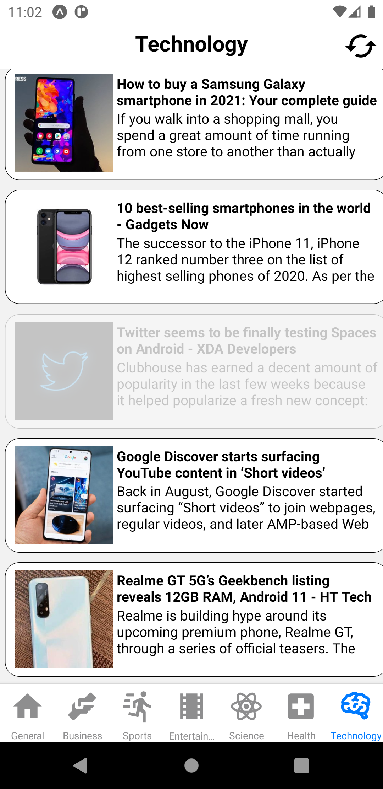

# ANews-App

Expo build Project in React-Native App. it fetches News article from News API and shows them in flatList view with 
Category filter in Bottom Navigation bar.

 <image src="./ScreenShots/home_ss.png" width="310px"/>
            
            

